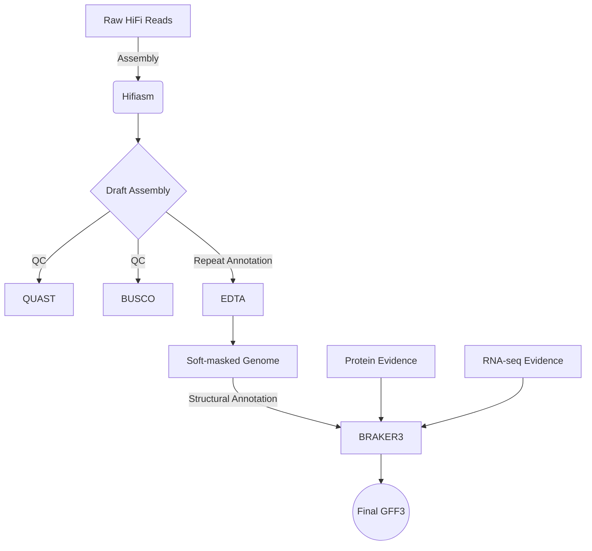

# PlantGenotationFlow 🌱


**PlantGenotationFlow** is a comprehensive, modular, and automated **Snakemake** pipeline designed specifically for **Plant Genome Assembly and Annotation**.

It integrates state-of-the-art tools to handle the complexity of plant genomes (large sizes, high repetitiveness, and heterozygosity). The pipeline goes from raw long-reads to a fully annotated GFF3 file.

```text
  _____  _             _   _____                 _        _   _             
 |  __ \| |           | | / ____|               | |      | | (_)            
 | |__) | | __ _ _ __ | || |  __  ___ _ __   ___| |_ __ _| |_ _  ___  _ __  
 |  ___/| |/ _` | '_ \| || | |_ |/ _ \ '_ \ / _ \ __/ _` | __| |/ _ \| '_ \ 
 | |    | | (_| | | | | || |__| |  __/ | | | (_) | || (_| | |_| | (_) | | | |
 |_|    |_|\__,_|_| |_|\__\_____|\___|_| |_|\___/ \__\__,_|\__|_|\___/|_| |_|
                      ______ ______ ______ 
                     |______|______|______|
                            Flow
````

## 🚀 Key Features

  * **Best-in-Class Assembly:** Uses **Hifiasm** for accurate haplotype-resolved assembly (optimized for PacBio HiFi).
  * **Plant-Specific Repeat Masking:** Integrates **EDTA (Extensive de-novo TE Annotator)** to handle complex plant transposons better than standard RepeatModeler.
  * **High-Accuracy Annotation:** Utilizes **BRAKER3** (combining GeneMark-ETP and Augustus) for evidence-based gene prediction using protein and/or RNA-seq data.
  * **Modular & Scalable:** Built on Snakemake modules (`.smk`), allowing easy maintenance and processing of multiple plant samples via a simple TSV sheet.
  * **Containerized:** Full support for Singularity/Docker to avoid dependency hell (crucial for EDTA and BRAKER).

## 🛠️ Workflow

The pipeline consists of 4 main modules:



## 📂 Directory Structure

```text
PlantGenotationFlow/
├── config/
│   ├── config.yaml          # Main configuration (threads, paths, containers)
│   └── samples.tsv          # Input data sheet
├── workflow/
│   ├── Snakefile            # Main entry point
│   └── rules/               # Modules
│       ├── assembly.smk
│       ├── qc.smk
│       ├── repeats.smk      # EDTA logic
│       └── annotation.smk   # BRAKER3 logic
└── results/                 # Output directory (auto-generated)
```

## 🔧 Installation & Prerequisites

1.  **Clone the repository:**

    ```bash
    git clone [https://github.com/yourusername/PlantGenotationFlow.git](https://github.com/yourusername/PlantGenotationFlow.git)
    cd PlantGenotationFlow
    ```

2.  **Install Snakemake:**
    Recommended via Mamba/Conda:

    ```bash
    conda install -c bioconda -c conda-forge snakemake mamba
    ```

3.  **Dependencies:**

      * **Singularity (Apptainer):** Required for running EDTA and BRAKER3 containers.
      * **Databases:** You need to prepare:
          * BUSCO lineage (e.g., `embryophyta_odb10`)
          * Protein reference FASTA (e.g., Viridiplantae proteins)

## ⚙️ Configuration

### 1\. `config/samples.tsv`

List your samples here. The pipeline can handle multiple genomes in parallel.

| sample\_id | platform | reads\_path |
| :--- | :--- | :--- |
| rice\_indica | hifi | data/raw/rice\_hifi.fq.gz |
| maize\_B73 | hifi | data/raw/maize\_hifi.fq.gz |

### 2\. `config/config.yaml`

Edit this file to point to your reference databases and container images.

```yaml
samples_file: "config/samples.tsv"

threads:
  assembly: 32
  annotation: 48

databases:
  busco_lineage: "embryophyta_odb10"
  protein_db: "/path/to/reference/proteins.fasta"

containers:
  edta: "docker://jianzuoyi/edta:latest"
  braker3: "docker://teambraker/braker3:latest"
  busco: "docker://ezlabgva/busco:v5.4.3_cv1"
```

## 🏃 Usage

**Dry run (Test the workflow):**

```bash
snakemake -np
```

**Run the pipeline (Local machine/Server):**

```bash
snakemake --use-conda --use-singularity --cores 48
```

**Run on Slurm/HPC:**

```bash
snakemake --profile config/slurm --use-conda --use-singularity
```

## 📊 Outputs

Upon completion, you will find the results in the `results/` directory:

  * **`results/assembly/{sample}/`**: Final assembly FASTA (`.p_ctg.fa`).
  * **`results/qc/{sample}/`**: BUSCO summary and QUAST HTML reports.
  * **`results/repeats/{sample}/`**: TE annotation statistics and soft-masked genome (via EDTA).
  * **`results/annotation/{sample}/`**: **The final `braker.gff3`** containing gene predictions.

## 🤝 Contributing

Contributions are welcome\! Please open an issue or submit a pull request.

## 📄 License

Distributed under the MIT License. See `LICENSE` for more information.
